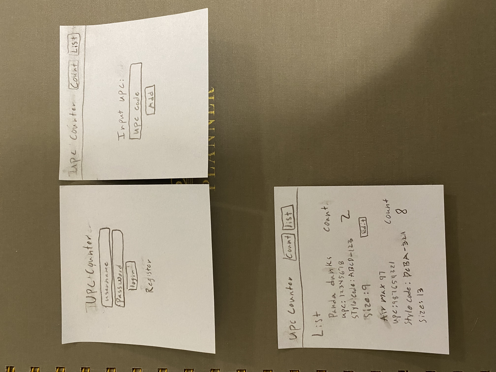

# UPC Counter

## Specifications

### Evaluator Pitch
Counting inventory manually is a pain, especially at BYU Football. With a wide array of different styles, sizes, and colors it is taxing to keep track of all the different items and not miscount items. The UPC Counter app makes this process easy by utilizing the UPC codes that are on the item's tags. The app takes in a UPC code and then adds that to the count of that item. After entering the desired items the user will then be able to view a list of all the total counts confident that each item was accounted for properly.

### Design

### Key Features
* Secure login over HTTPS
* Input UPC code for the item that is to be added to the count
* Add item information including name, style code, color code, and size
* View of counted items in the list
* Ability to clear count and start a new one
* Notifications when another user adds an item information
* Item info is persistently stored

## Technologies
I am going to use the required technologies in the following ways.

* HTML - This will be the layout of the 3 webpages. It will include text, input files, and buttons. 
* CSS - Make sure the website formats well on desktop and phone sizes. This will also create correct padding, colors, and font. 
* JavaScript - Provides login, adding a UPC item, adding a brand new item, and editing item information.
* Service - Backend service for login, adding new items, and retrieving item info.
* DB/Login - Input box and submit box for login. The database will hold items and their information. Once a user inputs a UPC code that is stored in the database that info will be sent to the client. 
* WebSocket - Sends a notification when someone enters a brand new item with info. 
* React - Application ported to use the React web framework.

## HTML deliverable

For this deliverable I built out the structure of my application using HTML.

- **HTML Pages** - 3 HTML pages that represent login, counting items, and a list of inventory items
- **Links** - After login you are linked to counting items. You can navigate between the counting and inventory pages. Log out takes you back to login page.
- **Text** - Count is represented in table of text. Inventory is represented as table of text. 
- **Images** - Barcode logo is present in the header of each page.
- **DB** - Tables of inventory will be generated by data pulled from data base.
- **Login** - Input box, password box, and submit button for login.
- **3rd Party Service Call** - This will either be the Disify to valididate the email of the user or a Yo Moma joke generated when the 'Tell me a Yo Mama Joke' button that is on the footer of the inventory List page.
- **WebSocket** - When someone adds a new item it shows up in the recently added item.

## CSS deliverable

For this deliverable I properly styled the application into its final appearance.

- **Header, footer, and main content body** - Consistent footer throughout the pages. Counter and InventoryList pages have a consistent header. All page have differing main content. 
- **Navigation elements** - Navigation bar on the counter and inventoryList page allows you navigate through pages and log out.
- **Responsive to window resizing** - App looks good on any device size. Header dynamically changes when the screen width gets too small. On the count page, the grid of counts dynamically formats based on screen width. 
- **Application elements** - Used good whitespace and formatting.
- **Application text content** - Consistent font throughout the page. Text is often formated using flex display. 
- **Application images** - UPC logo is displayed by the website name on each page. 

## JavaScript deliverable

For this deliverable I implemented by JavaScript so that the application works for a single user. I also added placeholders for future technology.

- **Login** - In order to login you must first register your username and password. On successful log in you go to counter page.
- **Database** - Displays counts on counter page and inventory items on inventory list page. Currently this is stored and retrieved from local storage, but it will be replaced with the database data later.
- **WebSocket** - I used the setInterval function to periodically add a entry to the recently added/edited popup. This will be replaced with WebSocket entries later.
- **Application Logic** - Ability to add, edit, and delete items. Once a item is saved in the inventory you can create a count of it.

## Service deliverable

For this deliverable I added backend endpoints in backend.js.

- **Node.js/Express HTTP service** - done!
- **Static middleware for frontend** - done!
- **Calls to third party endpoints** - Third party call to disify that verifies a entered email is valid. 
- **Backend service endpoints** - Placeholders for login that stores the current user on the server. Endpoints for counter and inventory list. 
- **Frontend calls service endpoints** - Frontend calls in main.js, index.js, counter.js and inventoryList.js. 

## DB/Login deliverable

For this deliverable I associate create login features. I stored items and counts in the database.

- **MongoDB Atlas database created** - done!
- **Stores data in MongoDB** - done!
- **User registration** - Creates a new account in the database.
- **existing user** - Can login in. Each users count is individually stored for them.
- **Use MongoDB to store credentials** - Stores username, email, and encrypted password.
- **Restricts functionality** - No functionally works if you aren't logged in. HTTPS requests won't work if not logged in. 

## WebSocket deliverable

For this deliverable I used webSocket to send a notification when a new item is added.

- **Backend listens for WebSocket connection** - done!
- **Frontend makes WebSocket connection** - done!
- **Data sent over WebSocket connection** - done!
- **WebSocket data displayed** - When an item is added it shows up in the recently added items popup.

## React deliverable

For this deliverable I converted the application over to use React.

- **Bundled and transpiled** - done!
- **Components** - Login, Header, InApp, Counter, CountItems, InventoryList, Accordion, and RecentlyAddedItems components
- **Router** - Routing between Login, Counter, and InventoryList
- **Hooks** - UseState used to store variables, useEffect used to load in data